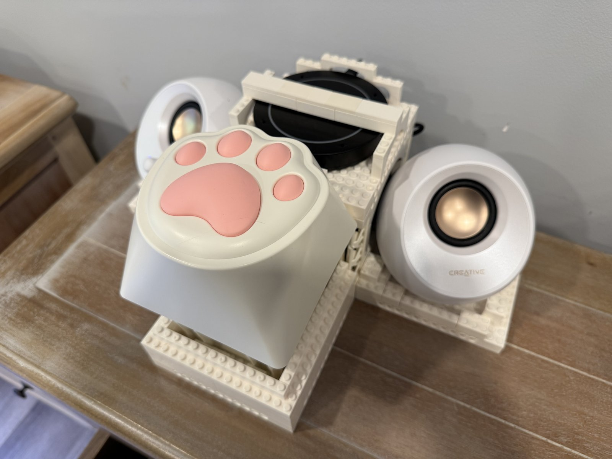
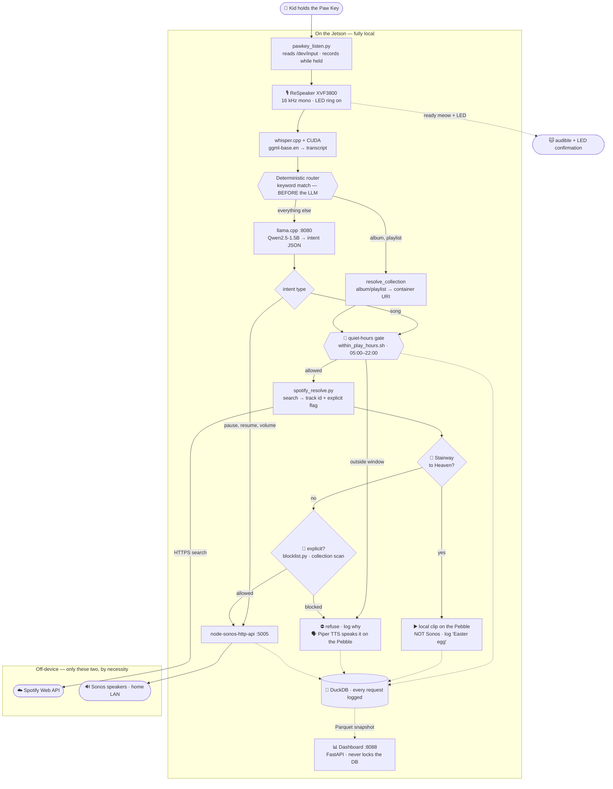

# Jetson Jukebox

<p align="center">
  
</p>

**Problem Statement**: my kids want to pick songs to play on the Sonos speaker, but I don't want hand them my phone. They could pick songs with explicit lyrics and read along to learn how to spell these words.

**Solution**: Create a screen-free AI workflow that lets them request songs with voice commands. It only listens when you physically hold down the button, filters out songs with explicit lyrics, and doesn't play songs at night when they should be sleeping.

A **screen-free voice jukebox for kids**, running on an NVIDIA Jetson Orin Nano Super.

> A kid presses the big cat-paw button, says *"play Let It Go,"* and the song
> starts on the family Sonos speakers — no screen, no app, no parent required.
> A meow confirms the system is awake and ready.

The AI runs **entirely on the device**. **whisper.cpp** transcribes the child's
speech into text on the Jetson's GPU, and a small local language model
(**Qwen2.5-1.5B-Instruct**) reads that text to work out the *intent* — which song
and artist, an optional room and volume, or a command like pause or "louder."
A child's voice is never sent to any cloud service.

Only two things live **off the device**, and both have to: the **Spotify catalog**
(searched over the internet to resolve the request to an exact track) and the
**Sonos speakers** (on the home LAN, where the music plays).

---

## How it works



> **The one structural idea to read off this diagram:** special cases (albums,
> playlists) are routed by **deterministic keyword matching *before* the small LLM
> ever runs** — the model is only asked to parse the *song / pause / resume /
> volume* case. And almost everything is **on the box**: the only off-device hops
> are the Spotify *catalog search* and the Sonos *speakers* themselves. The Sonos
> bridge and the Spotify-resolve script both run locally on the Jetson.

**Guardrails & logging.** A song passes two gates before Sonos: a
**deterministic quiet-hours clock check**
([`setup/within_play_hours.sh`](setup/within_play_hours.sh) — no LLM, just system
time vs. the allowed window, default 05:00–22:00) and a **content gate**
([`src/blocklist.py`](src/blocklist.py)) that **refuses tracks Spotify flags
explicit**. When either gate blocks a request, the retrieved track (or the
bedtime message) is **spoken aloud on the Pebble via local Piper TTS**, so the kid
hears *what* was turned down. That closes the gap between what a kid meant and what
the mic heard. Every request is logged to a local **DuckDB** database
(`data/jukebox.duckdb`): the transcript, parsed intent, the track search returned
(with the explicit flag), and the outcome (`played` / `blocked_time` /
`blocked_explicit` / `blocked_easteregg` / …) — a blocked request still records the
song it *would* have played, so a parent can review exactly what got stopped and
why. Per-artist/title blocklists slot into the same gate next. Details:
[docs/blocklist.md](docs/blocklist.md), [docs/data-logging.md](docs/data-logging.md).

**Bootstrapping / resilience** is owned by systemd under one umbrella unit,
`jukebox.target` — the Sonos bridge, the LLM server, the LED idle reset, the
Paw Key daemon, the dashboard, and a readiness check that plays the meow once
everything is healthy. See [services/README.md](services/README.md).

---

## Models used

| Stage | Model | Runtime | Notes |
|---|---|---|---|
| **Speech-to-text** | OpenAI **Whisper `base.en`** (`ggml-base.en`) | **whisper.cpp**, CUDA (sm_87) | English-only, ~1–1.5 GB. Runs from the CLI on the Jetson GPU. |
| **Intent understanding** | **Qwen2.5-1.5B-Instruct** (`Q4_K_M` quant) | **llama.cpp** `llama-server` on `:8080` | ~1.5–2 GB. Returns structured JSON `{type, title, artist, room, volume, direction}`. |
| **Catalog lookup** | Spotify **Web API** search (client-credentials) | cloud | Resolves a title to an exact `spotify:track:<id>`. Not an ML model — included for completeness of the path. |
| **Playback** | — | **node-sonos-http-api** on `:5005` (local) | Direct-URI play to a named Sonos room; runs on the Jetson. |
| **Text-to-speech** | **Piper** (`en_US-ryan-medium`) | **on-device** (aarch64 binary + ONNX voice) | ~60 MB, invoked on demand. Speaks the refused song on an explicit block and the quiet-hours "bedtime" line; output cached in `data/tts-cache/`. **Built** — falls back to a beep if the voice isn't installed. |

The two **always-on** ML models (Whisper, Qwen) are loaded **concurrently** and
compete for the shared 8 GB, which is the central constraint behind the whole
design; Piper is small and only runs on demand.

**Live memory footprint** (with the full stack running):

```
$ free -h
               total        used        free      shared  buff/cache   available
Mem:           7.4Gi       3.6Gi       150Mi       149Mi       3.6Gi       3.4Gi
Swap:          3.7Gi       771Mi       3.0Gi
```

- Of the **7.4 GiB** usable RAM, the running stack holds **3.6 GiB**, and only
  **150 MiB is truly free**. The other **3.6 GiB is reclaimable buff/cache**, so
  the kernel reports **~3.4 GiB available**.
- The box already leans on swap: **771 MiB of the 3.7 GiB** is in use. That headroom
  keeps the two models coexisting, and it's why every always-on service stays tiny
  and new work runs on demand rather than resident.

---

## Key ideas

- **Press-and-hold to talk.** A Keychron "Big Kitty" Paw Key is the only control.
  Hold it, speak, release. The mic's LED ring lights while it's listening.
- **Local-first AI.** Speech recognition and language understanding run on-device
  on the Jetson's GPU. No cloud STT, no cloud LLM, no per-request API cost, and a
  kid's voice never gets shipped to a third party.
- **Lean by necessity.** The board has **8 GB of memory shared between CPU and
  GPU**. Every model has to coexist in that budget, so the stack favors native
  C++ inference (whisper.cpp, llama.cpp) over heavyweight Python frameworks, and
  the orchestration layer is dependency-free plain Python.
- **It survives the real world.** Power loss, being unplugged, or being carried to
  another room and plugged back in all "just work" — systemd brings the whole
  stack back up at boot and plays the meow once every component is healthy.
- **Audible feedback, no screen.** Sound (the meow, spoken TTS) and the mic's LED
  ring carry readiness and confirmation — there's deliberately no display.
- **Parent-friendly guardrails.** A deterministic **quiet-hours** window keeps
  music off late at night / early morning; songs Spotify flags **explicit are
  refused** (and the refused title is **spoken aloud**, and logged); and every
  request is **logged locally** (DuckDB) so a parent can see what's asked for,
  played, and blocked — the foundation for a per-artist/title **blocklist**.

---

## What it does

1. **Listen** — Hold the Paw Key; the mic records while it's held.
2. **Transcribe** — whisper.cpp (on the GPU) turns the speech into text.
3. **Route** — a **deterministic keyword check runs first**: "album" / "playlist"
   play a whole collection, and Audible keywords ("continue my book", "audible
   `<book>`") route to the audiobook path. Anything else is handed to the small
   local LLM, which extracts the intent: *play a song*, *pause*, *resume*, *change
   the volume* — plus the song title/artist, an optional **room**, and an optional
   **volume**.
4. **Gate (quiet hours)** — for anything that plays music, a **deterministic clock
   check** decides if it's allowed right now (default **5:00 AM – 10:00 PM**).
   Outside that window the request is logged and *not* played — no Spotify call is
   even made — and a short spoken "past your bedtime" message plays.
5. **Resolve** — the title is looked up in the Spotify catalog to get an exact
   track id (and its explicit flag).
6. **Content gate** — if the track is flagged **explicit**, it's refused (logged
   as `blocked_explicit`) and the retrieved song + artist is **spoken aloud** on
   the Pebble via local Piper TTS, so the kid hears what was turned down;
   otherwise it continues.
7. **Play** — the track (or the pause/resume/volume command) is sent to Sonos, in
   the requested room (default Living Room), at the requested volume (otherwise
   the room's **current volume is kept**).
8. **Log** — the request is recorded to a local DuckDB database.
9. **Confirm** — audible/LED feedback.

A separate, always-on **web dashboard** (LAN, `http://<jetson>:8088`) lets a
parent review what was requested, what played, what **failed**, and what was
**blocked**, with time/room filters and a disk-health gauge. It reads a read-only
snapshot of the log, so it never interferes with playback. See
[docs/dashboard.md](docs/dashboard.md).

Supported spoken intents today: **play `<song>`** (optionally *"in the boys room"*
and/or *"at volume 30"*), **play the `<X>` album**, **play the `<X>` playlist**
(any public playlist, incl. Spotify's curated ones — see
[docs/collections.md](docs/collections.md)), **`<X>` audiobook / "continue my
book"** (Audible, [docs/audible.md](docs/audible.md)), **pause**, **resume/play**,
**volume up / down** / *"set the volume to N"*. A plain request is a song; "album"
and "playlist" are the keywords that switch to a whole collection. The default
room and quiet-hours window live in [`config/jukebox.env`](config/jukebox.env).

---

## Hardware

The locked-in stack (full detail + memory budget in [docs/hardware.md](docs/hardware.md)):

| Component | Part | Role |
|---|---|---|
| **Compute** | NVIDIA Jetson Orin Nano **Super** Dev Kit (8 GB, 67 TOPS) | Runs everything; 8 GB shared CPU/GPU RAM is the hard constraint |
| **Storage** | Samsung 990 PRO 1 TB NVMe | OS, models, app, data — the whole system boots from NVMe |
| **Microphone** | Seeed **ReSpeaker XVF3800** USB 4-Mic Array | Far-field capture, AEC/DOA/AGC, an LED ring, *and* an audio output |
| **Speaker** | Creative **Pebble V3** (USB) | Confirmation/TTS audio (music goes to Sonos, not here) |
| **Button** | Keychron **Big Kitty Paw Key** | The push-to-talk trigger (a USB HID device) |
| **USB hub** | **Sabrent** 4-Port USB 3.0 (externally powered) | All peripherals draw from the hub, not the Jetson's USB rail |
| **WiFi antennas** | Pair of **MHF4** u.FL flat antennas (added) | The dev kit ships with **no WiFi antennas at all**; we added a pair to the onboard AW-CB375NF |
| **Playback target** | **Sonos** speakers on the LAN | Existing home infrastructure; the music output |

> ⚠️ **Two hardware gotchas that cost us real time:** the powered hub is **not
> optional** (powering the Pebble off the Jetson coupled hum into the mic, heard
> as `(buzzing)` in STT), and the dev kit **ships with no WiFi antennas at all**
> — you have to add your own MHF4 u.FL pair (without them: weak signal → boot DHCP
> failures).
> More in [docs/peripherals.md](docs/peripherals.md) and [docs/runbook.md](docs/runbook.md).

---

## Repository layout

```
docs/        project docs — LESSONS (gotchas, read first), NEXT_STEPS, plan, hardware, peripherals, Sonos notes, runbook, data-logging, blocklist, dashboard, audible, collections
src/         the Python app — pawkey daemon, pipeline, intent, spotify_resolve, db
src/dashboard/  the request dashboard (FastAPI + Grid.js, snapshot-backed)
services/    systemd unit files + the boot architecture (jukebox.target)
setup/       install/build scripts (incl. within_play_hours.sh — the quiet-hours gate)
config/      jukebox.env (rooms, volume, quiet hours) + settings templates — secrets gitignored
models/      downloaded models (gitignored, on NVMe)
tools/       external clones: whisper.cpp, llama.cpp, node-sonos-http-api (gitignored)
assets/      sounds (the ready meow)
data/        DuckDB request log — data/jukebox.duckdb (gitignored)
tests/       per-stage + end-to-end smoke tests
```

Secrets (Spotify keys) live **only** in `tools/node-sonos-http-api/settings.json`
(gitignored); `config/sonos-settings.example.json` holds placeholders.

---

## Operating it

```bash
setup/install_services.sh              # install/enable all jukebox-*.service units
setup/jukebox_healthcheck.sh --status  # is everything up?
setup/sonos_play.sh "thunderstruck acdc"   # play a song by name (CLI)
src/listen_and_play.py --seconds 6     # one-shot voice test (record → STT → play)
setup/within_play_hours.sh; echo $?    # quiet-hours gate: 0 = allowed, 3 = blocked
# request dashboard (always-on): open http://jetson-orin-nano.local:8088/ in a browser
# inspect the request log (read-only — the daemon is the single writer):
python3 -c "import duckdb; [print(r) for r in duckdb.connect('data/jukebox.duckdb', read_only=True).execute('select requested_at, transcript, result_track_name, outcome from requests order by requested_at desc limit 20').fetchall()]"
```

For orientation as a developer (or a future agent session), start with
[CLAUDE.md](CLAUDE.md), then [docs/project_plan.md](docs/project_plan.md). If
something's broken at boot, go to [docs/runbook.md](docs/runbook.md).

## Status

**Working end-to-end:** push-to-talk → local STT → local intent → quiet-hours gate
→ Spotify resolve → Sonos play / pause / resume / volume, with **voice-specified
room and volume** (current volume kept by default), an **explicit-lyrics content
gate**, **albums & playlists**, a **Stairway easter egg** (local clip), **spoken
feedback** (Piper TTS reads back a blocked song and speaks the quiet-hours
message), **DuckDB request logging** (never purged), a **web dashboard** (requests
/ failures / blocked + explicit flag + disk health, snapshot-backed), and the
resilient boot stack + readiness meow. Assembled in a LEGO case.

**Not yet built:** a **per-artist/title blocklist** (slots into the same gate),
spoken **TTS confirmations for *successful* plays** (the blocked / quiet-hours
spoken feedback is already built), reliable **audiobook playback** (the routing is
built, but the Audible container won't play on the current Sonos firmware — see
[docs/audible.md](docs/audible.md)), and enclosure polish.
